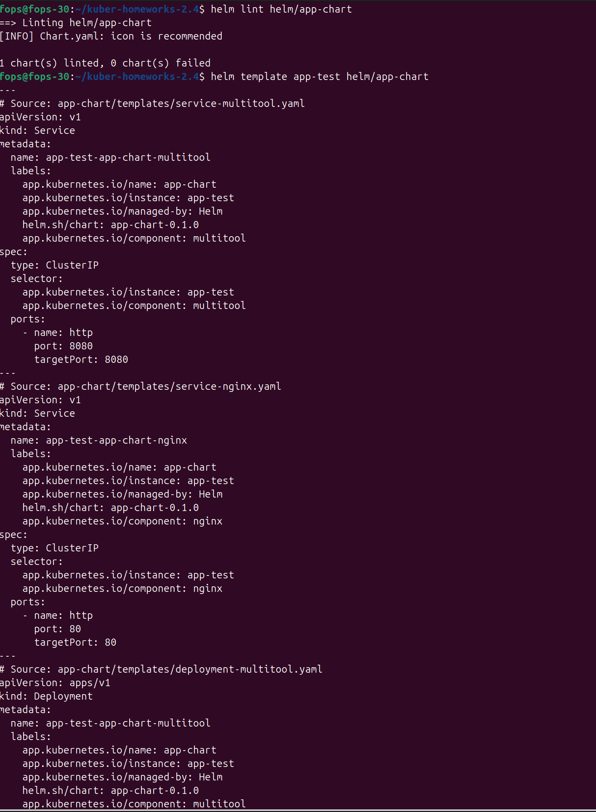
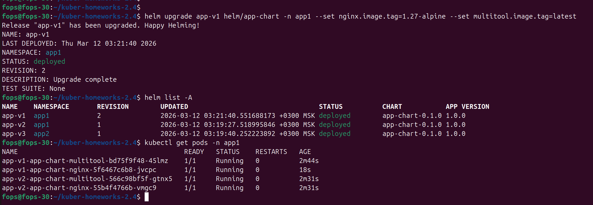

# Домашнее задание: «Helm»

## Цель задания
Установить и обновить приложения в Kubernetes с помощью Helm, подготовив собственный chart и развернув несколько его экземпляров в разных namespace.

---

## Используемое окружение
- Kubernetes: MicroK8S
- kubectl: установлен и настроен
- Helm: установлен
- ОС: Ubuntu 24.04 (VM)

---

# Задание 1. Подготовка Helm chart

## Структура chart
В репозитории подготовлен chart приложения:
- `helm/app-chart/Chart.yaml`
- `helm/app-chart/values.yaml`
- `helm/app-chart/templates/deployment-nginx.yaml`
- `helm/app-chart/templates/deployment-multitool.yaml`
- `helm/app-chart/templates/service-nginx.yaml`
- `helm/app-chart/templates/service-multitool.yaml`

## Проверка chart

```bash
helm lint helm/app-chart
helm template app-test helm/app-chart
```

Скриншот результата проверки chart:



---

# Задание 2. Запуск нескольких версий в разных namespace

## Создание namespace

```bash
kubectl create namespace app1
kubectl create namespace app2
```

## Установка релизов

### Первая версия в namespace app1
```bash
helm install app-v1 helm/app-chart -n app1 --set nginx.image.tag=1.25-alpine --set multitool.image.tag=latest
```

### Вторая версия в том же namespace app1
```bash
helm install app-v2 helm/app-chart -n app1 --set nginx.image.tag=1.26-alpine --set multitool.image.tag=latest
```

### Третья версия в namespace app2
```bash
helm install app-v3 helm/app-chart -n app2 --set nginx.image.tag=1.27-alpine --set multitool.image.tag=latest
```

## Проверка установленных релизов

```bash
helm list -A
kubectl get pods -A
kubectl get svc -A
```

Скриншот результата:


---

## Проверка обновления версии приложения

Пример обновления одного из релизов:

```bash
helm upgrade app-v1 helm/app-chart -n app1 --set nginx.image.tag=1.27-alpine --set multitool.image.tag=latest
helm list -A
kubectl get pods -n app1
```

Скриншот результата обновления:



---

# Итог

В ходе выполнения работы были:
- подготовлен собственный Helm chart;
- выполнена проверка chart командами `helm lint` и `helm template`;
- развернуты три экземпляра приложения в двух namespace;
- продемонстрировано обновление версии приложения через изменение переменных chart.

